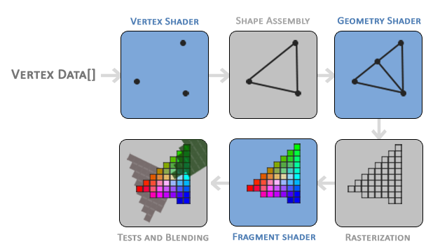

# Rendering Pipelin

랜더링 파이프라인이란 컴퓨터에서 이미지를 스크린에 표현하기까지 거치는 프로세스를 말한다. Modern OpenGL의 특징은 Shader를 통해서 다양한 표현을 할 수 있는 프로그램 가능한 4개의 스테이지를 제공한다는 점이다. 이러한 Shader는 GLSL (OpenGL Shading Language) 혹은 HLSL(High-Level Shading Language, Direct3D) 등을 통해서 작성된 코드이다. GLSL은 기본적으로 C 문법에 기반하며, 문헌에 따라 다양하게 분류하긴 하지만 OpenGL Super Bible은 다음과 같이 구분한다.

1. Vertex Fetch
1. Vertex Shader (programmable)
1. Tessellation Control Shader (programmable): OpenGL 4.0 이상 지원
1. Tessellation
   - 정점 데이터를 더 작은 primitive 들로 분해할 수 있다.
   - 일반적으로 물, 바다 등과 같은 다이나믹한 물체들을 표현할 때 효과적으로 사용될 수 있다.
1. Tessellation Evaluation Shader(programmable): OpenGL 4.0 이상 지원
1. Geometry Shader (programmable)
   - Primitive를 처리하며, primitive의 집합을 입력받아 원하는 형태로 처리된 primitive의 집합을 출력한다.(없애거나 추가하거나 다른 것으로 변환)
   - 변환된 프리미티브 목록은 Rasterization을 통해 픽셀과 매칭된 Fragment list를 만든다. 이 과정에서 view-frustrum 밖의 Fragment는 폐기한다.
1. Rasterization
   - Vertex Post-Processing
     - Transform Feedback (optional): Vertex/Geometry 쉐이더 결과를 나중에 사용하기 위해 저장한다.
     - Clipping: View-frustrum 밖에 있어서 화면에 보이지 않는 primitive들을 제거한다. 클립 공간에서 윈도우 (스크린) 공간으로 변환된다.
   - Primitive Assembly
     - 정점들의 집합이 primitive의 집합으로 변환되고, Face culling 처리가 수행된다.
   - Rasterization
     - Primitive들을 각 픽셀에 해당하는 데이터인 fragment로 변환하여 fragment list를 출력한다.
     - fragment data는 각 정점 데이터에 기반해서 interpolation된다.
1. Fragment Shader (programmable)
1. Frame Buffer (per-sample) Operation
   - fragment가 그려져야 하는지 다양한 테스트들이 수행된다.
     - Depth Test (depth & stencil check)
     - Alpha Test (color blending)

## Primitives

- OpenGL 랜더링의 최소 단위는 primitive이며 primtive는 정점 (vertex)의 집합이다. OpenGL은 많은 타입의 프리미티브를 지원하지만 기본적인 것들로 점 (point), 선 (line), 삼각형 (triangle)이 있다.
- 일반적으로 삼각형 primitive를 많이 사용한다. 삼각형은 항상 convex하므로 그리는 규칙은 만들고 구현하기 쉽다. 따라서 애플리케이션은 화면에 그려질 surface를 수많은 삼각형으로 분할하고 OpenGL을 통해 래스터라이저 (rasterizer)라는 하드웨어 가속기로 보내서 랜더링을 한다.
- 래스터라이저는 3차원으로 표현된 삼각형들을 화면에 그려질 픽셀들로 변환하는 역할을 한다.

## Simple Rendering Pipeline

- 그래픽스 시스템의 랜더링 파이프라인은 OpenGL Super Bible에서는 9개의 스테이지로 구분하였지만 실제 사용자 관점에서는 크게 두 개의 파트 (front-end, back-end)로 구분할 수 있다.
  - front-end는 랜더링할 surface를 프리미티브들로 분할한다. 이를 래스터라이저로 보낸다.
  - back-end는 geometry가 처리되어 각각이 픽셀화된다.
- 특히, 고급 사용자가 아닌 초보자 입장에서는 우리가 프로그램할 랜더링 스테이지는 다음의 3개이다.
  - Vertex Shader: Vertex 정보를 기반으로 Vertex를 처리한다.
  - Fragment Shader: Vertex Shader 출력을 입력으로 받아서 각 픽셀의 출력값을 계산한다.
  - Geometry Shader: 웹 리소스에서는 잘 다루지 않지만 다룰 줄 알면 생각보다 쉽게 고급 기능을 사용할 수 있어서 실무에서는 많이 쓰인다고 한다.

## Vertex Fetech

- VERTEX는 OpenGL에서 저장하고 있는 Geometry의 point에 대한 정보이며 position, normal, color, texture 등의 다양한 attribute에 대한 정보를 가지고 있다. 정점마다 버텍스 패칭 (혹은 풀링)이 실행되어 자동적으로 계산된다.
- 해당 정보들은 VAO (Vertex Array Object)와 VBO (Vertex Buffer Object)를 통해서 CPU에서 GPU로 전달된다.
- VAO은 각 정점이 어떤 데이터를 가지고 있는지 (What data a vertex has)에 대한 정보를 제공하며, VBO는 그 정보를 담고 있는 버퍼이다. Atrribute Pointer를 통해서 Shader가 어떻게 (how) 해당 정점 데이터에 어디서 (where) 접근할지 정의할 수 있다.

### Creating VAO/VBO

1. Generate a VAO ID
2. Bind the VAO with that ID
3. Generate a VBO ID
4. Bind the VBO with that ID (2에서 바인딩한 VAO에 연계된 현재 바인딩한 VBO에서 작업 시작)
5. Attach the vertex data to that VBO
6. Define the Attribute Pointer format
7. Enable the Attribute Pointer
8. Unbind the VBO and VAO, ready for the next object

### Initiating Draw

1. Activate shader program you want to use
2. Bind the VAO of objects that you want to draw
3. Call **Draw Call** (e.g. glDrawArrays), which initiates the rest of the pipeline

## Vertex Shader

- 필수 랜더링 스테이지이며 각 정점이 개별적으로 다뤄진다. 즉, 정점마다 쉐이더 프로그램이 호출되며, 해당 정점들을 MVP 변환을 통해 Object space에서 Clip Space까지 변환된 **gl_Position**을 출력한다.
- 입력: **VERTEX Data[]**
- 출력: **gl_Position**, additional data
  - 쉐이더를 통해서 위치 이외에 우리에게 필요한 정보를 파이프라인에 제공하는 것이 가능하다.

## Fragment Shader

- Vertex shader와 달리 optional이지만 거의 대부분 사용한다.
- Fragment list를 입력받아 화면에 출력할 모든 픽셀의 색상 (color)을 계산하며, 이 과정에서 OpenGL의 고급 효과들이 계산되어 추가되어 Frame buffer에 저장된다.
