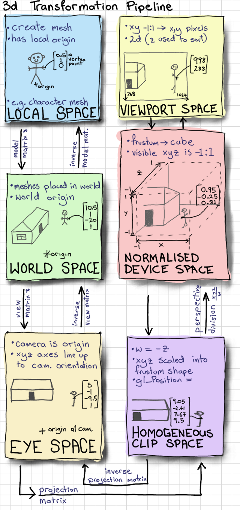

# 3D Transformation Pipeline

- OpenGL에서 정점들을 처리하기 위해서는 정점의 좌표들은 모두 NDC (Normalized Device Coordinate)로 변환하여 래스터라이저에 입력해야한다. 하지만 우리가 3D 월드에서 표현하고자 하는 것들을 처음부터 NDC로 계산하는 것을 어려운 일이기 때문에 여러 단계의 좌표계 변환을 통해서 이를 계산하게 된다.
- 이때 중요한 공간은 다음의 6가지가 있다.
  - Local Space
  - World Space
  - View Space
  - Clip Space
  - Screen Space

## Local Space (Object Space)

- 객체 (Object)의 원점을 중심으로 한 공간으로 객체의 모델링을 불러들여오면 객체의 각 정점들이 로컬 좌표계 (local coordinate)에서 표현되어 있다
- 객체를 표현하는 좌표계로서 각 정점의 위치는 로컬 원점에 대한 상대적인 값으로 해석된다.

## World Space

- 객체들이 있는 월드에 대한 대한 공간으로 월드 좌표계 (world coordinate)에서 각 객체들의 원점의 위치가 표현되어 있다.
- 객체들의 정점을 로컬 공간이 아닌 월드 공간에서 표현하는 것도 가능하지만 이럴 경우 객체를 변형 혹은 변경할 경우 일일이 대응해야 한다.
- 빛 효과나 물리 계산이 일어나는 공간이다.
- **Model Matrix** (${^W}\!T_{L}$)
  $${^W}\!r = \begin{bmatrix}x_w \\ y_w \\ z_w \end{bmatrix}= {^W}\!T_{L} {^L}\!r = {^W}\!T_{L}\begin{bmatrix}x_l \\ y_l \\ z_l \end{bmatrix} $$

## View Space (Eye Camera or Camera Space)

- 카메라 좌표계는 세계 좌표계에서의 camera origin을 기준으로 하고 camera axis (x: right, y:up, z:backward)와 정렬되어 있는 좌표계이다.
- 월드 공간에서 표현된 좌표들을 카메라가 볼 때 어떻게 표현되는지 알 수 있다.
- **View Matrix**(${^E}\!T_{W}$)
  $${^E}\!r = \begin{bmatrix}x_e \\ y_e \\ z_e \end{bmatrix}= {^E}\!T_{W} {^W}\!r = {^E}\!T_{W}\begin{bmatrix}x_w \\ y_w \\ z_w \end{bmatrix} $$

## (Homogeneous) Clip Space (Clipping-Volume Space)

- 카메라 좌표계에서 표현된 월드 공간에 대한 Clipping이 이루어지는 3차원 공간이다.
- 이 공간은 4차원 homogeneous coordinate (x, y, z, w)로 표현되며, scale 차원인 $w_c$가 $-z_e$가 되는 공간이다. Veretx Shader가 glPosition에 데이터를 쓸 때 이 공간에 있다고 한다.
- **Projection Matrix**($P$)
  - Perpective proejction의 경우는 원근이 고려되며 Orthographic projection의 경우 원근이 무시된다.
    $$^{C}\!\bar{r} = \begin{bmatrix} x_c \\ y_c \\  z_c\\ w_c\end{bmatrix}= P\ ^{E}\!\bar{r} = P\ \begin{bmatrix} x_e \\ y_e \\  z_e\\ 1\end{bmatrix}$$

## Normalized Device Space

- 클립좌표계가 계산되면 OpenGL 내부적으로 Perspective division을 통해 Normalized Device Space로 자동으로 변환된다.
- Normaized Device Space에서는 x, y, z가 모두 `[-1, 1]`의 영역에 있다. 결국 NDS는 최종적으로 2x2x2 cuboid가된다. 정규화된 좌표를 사용함으로써 Viewport 크기 변화에 따르 좌표계산 과정을 줄이고 빠르게 대응할 수 있다.

    $$^{N}\!\bar{r} = \begin{bmatrix} x_n \\ y_n \\  z_n\\ 1\end{bmatrix}= \frac{1}{w_c}\begin{bmatrix} x_c \\ y_c \\  z_c\\ w_c\end{bmatrix}$$

## Viewport Space (Screen Space)

- NDC로 표현된 클립 공간 (2x2x2 cuboid)를 2차원으로 변환하여 화면에 출력하는 공간이다. 최종적으로 화면에 출력되는 카메라 이미지라고 생각하면 된다.
- 클립 공간의 x는 화면에서 오른쪽 방향, y는 화면에서 아래 방향이며 원점은 화면의 좌측 상단이다.
- **Viewport Transform**에 클립 공간이 스크린 공간으로 변환된다.
  $$ \begin{bmatrix} x_s \\ y_s \end{bmatrix}= V \begin{bmatrix} x_n\\ y_n \end{bmatrix}$$
- `glViewport()` 함수로

## Model-View Transformation

- 모델 공간을 랜더링하기 위해 뷰 공간으로 변환하는 것을 말하며, 모델 행렬과 뷰 행렬을 곱해서 모델-뷰 행렬을 계산할 수 있다.
- 일반적으로 정점들은 월드 공간으로 이동시킨 후 한번에 변환하는 것보다 모델-뷰 행렬을 통해 한번에 변환하는 것이 효율적이며, 부동소수점 연산에 의한 정밀도에도 유리하다.
$$^{E}\!T_{L} = ^{E}\!\!T_{W} \!\ ^{W}\!T_{L}$$

## Projection Transformation

- 모델-뷰 행렬에 의해서 계산된 정점들을 화면 상의 최종 이미지로 어떻게 투영하는지 결정할 때 사용된다.
- OpenGL의 투영 변환은 뷰 볼륨과 클리핑 평면을 정의하며, 클리핑 평면은 OpenGL이 Geometry가 보이는지 판단하기 위해 사용하는 3D 공간 상의 평면 공식이다.
$$^{E}\!T_{L} = ^{E}\!\!T_{W} \!\ ^{W}\!T_{L}$$

## Reference

1. [OpenGL Projection Matrix](http://www.songho.ca/opengl/gl_projectionmatrix.html)
2. [OpenGL Coordinate Systems](https://learnopengl.com/Getting-started/Coordinate-Systems)
3. [Mouse Picking with Ray Casting](https://antongerdelan.net/opengl/raycasting.html)
4. [3D Graphics with OpenGL](https://www3.ntu.edu.sg/home/ehchua/programming/opengl/CG_BasicsTheory.html)
