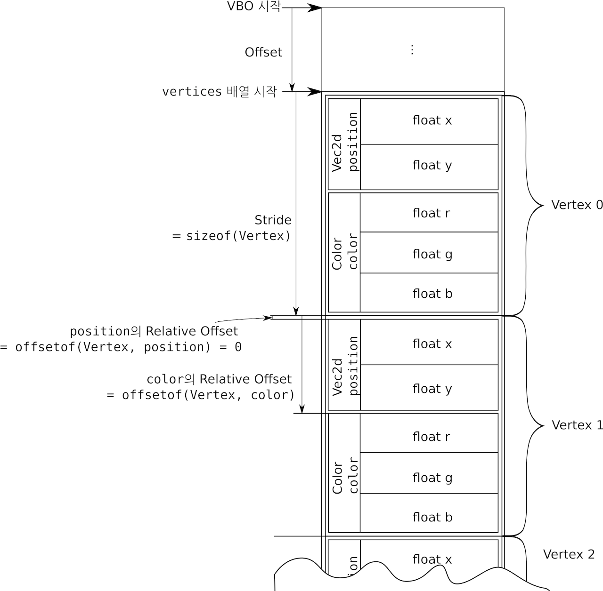

# Data Handling

## Buffer

- OpenGL에서 버퍼는 여로 용도로 사용할 있는 연속적인 메모리 공간이며, **이름(name)**으로 구별한다. 버퍼를 사용하기 전에는 OpenGL을 통해 사용할 이름을 예약하고 그 이름을 사용해서 메모리(data store)를 할당한 후 거기에 데이터를 저장해야 한다.
- OpenGL은 버퍼의 이름을 OpenGL context에 attach하고 애플리케이션을 통해 해당 버퍼에 데이터를 쓰거나 읽어올 수 있다. 이 때, attach하기 위해서는 해당 이름을 버퍼 바인딩 포인트에 bind해야 한다. OpenGL에는 다양한 버퍼 바인딩이 존재하는데 버퍼의 내용이 Vertex Shader로 자동으로 공급되거나 Shader가 사용한 변수의 값을 입력하거나 아니면 쉐이더가 생성하는 데이터를 저장할 공간으로 사용할 수 있다.
- **Vertex buffer**는 GPU에 넣을 정점들에 대한 정보를 가지고 있는 메모리 버퍼이며 Object 단위로 관리된다. 이를 **Vertex Buffer Object (VBO)**라 부른다.
- OpenGL은 다른 그래픽스 API와 달리 명시적으로 vertex buffer를 제공하지 않지만 정점의 속성을 저장하는 버퍼 바인딩 포인트(e.g. `GL_ARRAY_BUFFER`)를 제공한다. 이를 통해서 다른 그래픽스 API의 VBO와 동일한 역할을 하도록 할 수 있다. 여기서 버퍼 바인딩 포인트는 OpenGL에게 해당 버퍼를 어떤 용도로 사용할지 알리는 것이다.
- 매 프레임마다 CPU에서 정점 데이터를 GPU로 보내는 것은 효율직이지 않다. CPU에서 한번에 많은 양의 정점 속성들을 GPU 메모리 상에 전송하고 GPU가 이를 필요할 때마다 사용하면 랜더링 효율을 높일 수 있다.

```c++
void glGenBuffer(GLsizei n, GLuint *buffers);
// (https://docs.gl/gl4/glGenBuffers)
// 버퍼 ID 배열를 입력받아 n개의 버퍼를 만든다.
// - n: 생성할 버퍼의 개수
// - buffers: 버퍼를 생성할 ID의 배열

void glBindBuffer(GLenum target, GLuint buffer);
// (https://docs.gl/gl4/glBindBuffer)
// 타겟 버퍼 바인딩 포인트 (target)에 해당 ID (buffer)의 버퍼를 바인딩한다.
// - target: 버퍼 파인딩 포인트 (버퍼의 타입), vbo의 경우, GL_ARRAY_BUFFER 사용
// - buffer: 버퍼 ID
// opengl 4.3 이상에서는 아래의 함수를 지원한다.
void glBindVertexBuffer( GLuint bindingindex, GLuint buffer, GLintptr offset, GLintptr stride); // gl 4.3 이상 지원
void glVertexArrayVertexBuffer( GLuint vaobj, GLuint bindingindex, GLuint buffer, GLintptr offset, GLsizei stride); // gl 4.5 이상 지원
// (https://docs.gl/gl4/glBindVertexBuffer)
// - vaobj: glVertexArrayVertexBuffer에서 사용된 vao ID
// - bindingindex: 버퍼를 바인딩할 버퍼 비인딩 포인트 인덱스
// - buffer: 버퍼 ID
// - offset: 버퍼 처음 요소의 오프셋
// - stride: 버퍼 안에서 해당 요소까지의 거리
void glBindVertexBuffers( GLuint first, GLsizei count, const GLuint *buffers, const GLuintptr *offsets, const GLsizei *strides);
void glVertexArrayVertexBuffers( GLuint vaobj, GLuint first, GLsizei count, const GLuint *buffers, const GLintptr *offsets, const GLsizei *strides);


void glBufferData(GLenum target, GLsizeiptr size,const GLvoid * data, GLenum usage);
// (https://docs.gl/gl4/glBufferData)
// 바인딩한 버퍼 객체를 사용해서 메모리를 할당하고 사용자기 정의한 데이터를 현재 할당한 타겟 타입의 버퍼에 복사한다.
// - target : 데이터를 복사하여 집어넣을 버퍼의 타입, 할당한 버퍼가 어떤 역할을 하는 버퍼에 바인딩될 지 결정한다.
// - size   : 버퍼에 저장할 데이터 크기(바이트 단위), 주로 sizeof 사용
// - data : 버퍼에 저장할 데이터의 메모리 포인터, 이 데이터가 어떤 레이아웃을 가지고 있는지 모르므로 
//          Vertex Attribute와 Shader를 통해서 전달한다.
// - usage : GPU가 주어진 데이터를 관리하는 방법 (다양한 옵션들이 더 있으나 여기서는 DRAW 옵션에 집중한다)
//    - GL_STATIC_DRAW : 거의 변하지 않는 데이터 (한번 수정되고 여러 번 사용하는 경우)
 //   - GL_DYNAMIC_DRAW : 자주 변경되는 데이터 (반복적으로 수정되고 여러 번 사용하는 경우)
 //   - GL_STREAM_DRAW : 그려질 때마다 변경되는 데이터
 //   - DYNAMIC, STREAM으로 전달할 경우,GPU는 빠르게 사용할 수 있는 메모리에 데이터를 저장한다.
 // 버퍼에 데이터를 전달하는 다른 방법으로는 glBufferSubData(), glMapBuffer()가 있다.


void glDrawArrays( GLenum mode, GLint first, GLsizei count);
// (https://docs.gl/gl4/glDrawArrays)
// 바인딩한 버퍼 데이터를 지정한 프리미티브 타입으로 랜더링한다. 
// - mode : 랜더링할 프리미티브의 타입을 지정
// - first: 배열의 시작 인덱스
// - count: 렌더링할 인덱스 개수를 지정
// Index buffer를 위해서는 glDrawElements를 사용하면 된다.
```

```c++
// 이름 (버퍼를 구별하기 위해 사용하는 핸들 (혹은 ID))을 받을 변수를 준비한다.
GLuint vbo = 0; 
// 버퍼 이름 (핸들)을 생성한다.
glGenBuffers(1, &vbo);  
// 해당 이름을 가진 버퍼를 특정 타입으로 컨텍스트에 바인딩한다. 여기서는 GL_ARRAY_BUFFER 바인딩 포인트 사용
glBindBuffer(GL_ARRAY_BUFFER,vbo);  

float vertices[] = {
    -0.5f, -0.5f, 0.0f,  // left
    0.0f,  0.5f,  0.0f,  // top
    0.5f,  -0.5f, 0.0f   // right
};

// 현재 바인딩된 버퍼에 메모리를 할당하고 데이터를 복사한다.
glBufferData(GL_ARRAY_BUFFER, 9 * sizeof(float), &vertices[0],
              GL_STATIC_DRAW);
```

## Vertex Attribute

- 버텍스 버퍼에는 버텍스 좌표, 텍스쳐 좌표, 노멀 벡터 등의 여러 데이터가 들어갈 수 있다. 하지만 OpenGL에게는 버퍼는 그냥 메모리일 뿐이므로 이 메모리가 어떤 레이아웃을 가지고 있는지 알려줘야 한다. 버텍스 속성은 버텍스 데이터가 OpenGL 파이프라인에서 어떻게 처리되어야 하는지 결정한다. 모던 OpenGL은 버텍스 속성을 쉐이더와 연계하여 처리할 수 있도록 지원한다.
- 각 vertex attribute은 Vertex Array Object (VAO)에 저장된다.



```c++
void glEnableVertexAttribArray(GLuint index);
// (https://docs.gl/gl4/glEnableVertexAttribArray)
// 쉐이더의 해당 layout index에 속성을 자동으로 채울지 말지를 설정한다. (일반적으로 설정하는 것이 편하다.)
// - index: 바인딩된 VAO의 attribute slot index

void glDisableVertexAttribArray(GLuint index);
// (https://docs.gl/gl4/glEnableVertexAttribArray)
// VBO의 데이터를 사용하여 속성 채우기를 마친 경우 사용하며, 해당 속성을 비활성화한다
// 이 경우, 다시 glVertexAttrib*를 사용하여 쉐이더에 지정한 값을 전달해야 한다.
// - index: 바인딩된 VAO의 attribute slot index

void glVertexAttribPointer(GLuint index, GLint size, GLenum type,
          GLboolean normalized, GLsizei stride,const GLvoid * pointer);
// (https://docs.gl/gl4/glVertexAttribPointer)
// 특정 인덱스를 가진 Vertex에 attribute data를 정의한다. OpenGL에 데이터가 버퍼 객체의 어디에 있는지 알려준다.
// 지정한 속성에 대해서는 자동 vertex fetching을 활성화한다.
// - index: vertex attribute index, shader의 layout과 연과된다.
// - size: 데이터의 사이즈가 아니라 attribute가 가지는 컴포넌트의 개수이다. 
//         1~4의 값을 가진다. (예를 들어 Float 2개로 이루어진 벡터이면, 2가 들어간다.)
// - type: 데이터의 type (int32_t, float 등)
// - normalized: 픽셀 값을 입력할 때, float은 0~1사이의 값을 가져야 하므로 
//               이렇게 데이터 변환이 필요한 경우만 true로 입력한다.
// - stride: 각 Vertex는 여러 attribute을 가지며, 그에 따른 크기를 가진다.
//           따라서 vertex사이을 옮겨가려면 이 크기만큼 offset을 가지며 이동해야한다.
// - pointer: vertex 내에서 attribute으로 이동하기 위한 offset, 해당 vertex buffer의 시작으로 이동하기 위해 사용된다.

void glGetAttribLocation()
```

## Uniform

- GPU에 데이터를 전달하는 다른 방법으로 uniform이 있다. 정점 속성을 통해 CPU의 메모리를 GPU의 메모리로 데이터를 전달했다면, uniform은 애플리케이션이 직접 쉐이더에 글로벌 변수의 형태로 데이터를 전달할 수 있으며,이는 전달한 데이터를 파이프라인의 모든 단계에서 접근가능하다는 의미이다.
- 정점 속성은 위치, 법선 벡터 방향, 텍스쳐 좌표 등의 정점 별로 필요한 데이터인데 반해 유니폼은 전체 프리미티브들을 대규모로 랜더링하는 동안 변하지 않고 균일하게 남아있는 데이터를 GPU에 전달하는 형태로 많이 활용된다.
- 유니폼은 항상 상수로 간주되므로 쉐이더 코드 내에서 할당할 수 없지만 기본값은 넣을 수 있다는 점을 알아두자
- 디폴트 블록에 선언하는 방식과 유니폼 블록에 선언하는 2가지 방식이 있다.

### Default Block

- 디폴트 블록 유니폼을 선언하는 방식은 변수 앞에 `uniform` 키워드를 넣는 것이다.
- 정점 속성과 동일하게 쉐이더 코드 내에서 레이아웃 위치를 지정할 수 있지만 특별히 지정하지 않을 경우, OpenGL이 자동으로 할당하며 `glGetUniformLocation()`으로 해당 레이아웃 위치를 확인할 수 있다. 유니폼의 타입에 따라 `glUniform*()` 함수를 사용해서 값을 입력한다.
  - glUniform1f – Single floating value
  - glUniform1i – Single integer value
  - glUniform4f – vec4 of floating values
  - glUniform4fv – vec4 of floating values, value specified by pointer
  - glUniformMatrix4fv – mat4 of floating values, value specified by pointer
- 벡터나 행렬을 전달할 수도 있으며, 행렬의 경우 OpenGL이 선호하는 column-wise로 데이터가 저장되어 있음에 유의하자. 일반적인 경우는 row-wise로 행렬 데이터를 저장하므로 glm이 아닌 수학 라이브러리를 사용할 경우 데이터 저장순서를 확인하고 column-wise가 아니면 OpenGL에 맞게 변형해주어야 한다.
  
```c++
layout(location = 0) out vec4 color;
// layout(location = 17 ) uniform vec4 u_Color; // case(1)
uniform vec4 u_Color; // case(2)

void main()
{
    color = u_Color;
};
//----------------//
GLint uColorLocation = glGetUniformLocation(shaderProgram, "u_Color");
glUniform4f(uColorLocation, 0.2f, 0.3f, 0.8f, 1.0f);
```

```c++
GLint glGetUniformLocation( GLuint program, const GLchar *name);

void glUniform*(GLuint location, parameters...)

```

### Uniform Block

- 만약 아주 복잡한 쉐이더를 작성하게 된다면, 많은 상수 데이터가 필요하기 때문이 이를 한번에 하나씩 CPU에서 GPU로 전달하는 것은 비효율적인 일이다. 따라서 `glUniform*()` 함수를 매번 호출하는 성능저하를 막고 유니폼을 더 쉽게 공유하기 위해 유니폼 블록이 제공되고 이를 다루는 버퍼 객체를 Uniform Buffer Object (UBO)라 한다.

<!-- TOOD: OpenGL Super Bible 5.2.2 (p127) 정리하자. -->

## Vertex Array Object (VAO)

- VAO는 OpenGL 파이프라인의 정점 패치 (vertex fetch) 스테이지를 나타내는 객체이며, 최초 입력인 정점 정보를 Veretx Shader에 공급한다. 즉, 화면을 그리기 전에 VAO를 생성해서 정점 정보를 넣어줘야만 Modern OpenGL이 정상적으로 화면을 그릴 수 있다.
- VAO는 Vertex Attribute의 리스트와 VBO 바인딩 리스트로 구성되며 일반적으로 16개의 slot을 가지고 있다. 정점 속성(정정 데이터의 메모리 레이아웃)을 다수 저장하고 있다가 이를 바인딩된 VBO와 연결하여 vertex shader에 제공할 정점 데이터를 해석한다. VAO는 OpenGL 컨택스트 객체에게 정점 데이터가 저장된 VBO와 이와 연관된 attribute을 지정함으로써 매 프레임마다 VBO와 attribute를 지정하지 않을 수 있게 해준다.
- OpenGL에서는 VAO를 사용하기 위해서 VertexArray를 제공한다.


```c++
void glCreateVertexArrays(GLsizei n, GLuint* arrays);
// (https://docs.gl/gl4/glCreateVertexArrays)
// VAO ID 배열을 입력받아 n개의 vertex array를 만들고 OpenGL 컨택스트에 attach한다. (gl 4.5이상 지원)
// - n: 생성할 VAO의 개수
// - arrays: VAO ID의 배열

void glGenVertexArrays(GLsizei n, GLuint* arrays);
// (https://docs.gl/gl4/glGenVertexArrays)
// VAO ID 배열을 입력받아 n개의 vertex array를 만들고 OpenGL 컨택스트에 attach한다. (gl 3.0이상 지원)
// - n: 생성할 VAO의 개수
// - arrays: VAO ID의 배열

void glBindVertexArray(GLuint array);
// (https://docs.gl/gl4/glBindVertexArray)
// 해당 ID를 가지는 VAO를 바인딩한다.
// - array: VAO ID (헨들)

void glDeleteVertexArrays(GLsizei n, GLuint* arrays);
// (https://docs.gl/gl4/glDeleteVertexArrays)
// - n: 삭제할 VAO의 개수
// - arrays: VAO ID의 배열
```

## Index Buffer Object (IBO)

- 예를 들어 큐브를 그릴 경우, 총 12개의 삼각형이 필요하며 (면 당 2개) 이를 그리기 위해 총 36개의 정점을 GPU로 전달해야 한다. 하지만 실제로 큐브의 정점은 8개만 있으면 되므로 중복 정보를 여러 번 GPU에 제공하는 것은 비효율적이다.
- 따라서 8개의 정점 데이터와 그에 대한 인덱스 정보를 제공하는 것이 훨씬 효율적이다. 이를 위해 필요한 것이 index buffer이다. OpenGL에서는 별도의 IBO 객체를 제공하지 않지만 인덱스를 제공하는 용도로 별도의 버퍼 타입인 `GL_ELEMENT_ARRAY_BUFFER`를 제공한다. 따라서 IBO를 이용하여 물체를 그릴 경우, VAO에 IBO 버퍼를 만들고 attach하면 된다.

## Summary

- OpenGL에서 제공하는 데이터 핸들링 방식을 이용하여 Mesh를 그리는 법은 다음과 같다.

### Create Mesh

1. `glGenVertexArray(1, &VAO)`
2. `glBindVertexArray(VAO)`
3. `glGenBuffers(1, &IBO)`
4. `glBindBuffer(GL_ELEMENT_ARRAY_BUFFER, IBO)`
5. `glBufferData(GL_ELEMENT_ARRAY_BUFFER, sizeof(indicies[0]) * num_indicies, verticies, GL_DYNAMIC/STATIC_DRAW)`
6. `glGenBuffers(1, &VBO)`
7. `glBindBuffer(GL_ARRAY_BUFFER, VBO)`
8. `glBufferData(GL_ARRAY_BUFFER, sizeof(vertices[0]) * num_vertices, vertices, GL_DYNAMIC/STATIC_DRAW);
9. `glVertexAttribPointer(i, ...)`
10. `glEnableVertexAttribArray(i,)`
11. Reset
    - `glBindBuffer(GL_ARRAY_BUFFER, 0);`
    - `glBindBuffer(GL_ELEMENT_ARRAY_BUFFER, 0);`
    - `glBindVertexArray(0);`

### Render Mesh

1. `glBindVertexArray(VAO);`
2. `glBindBuffer(GL_ELEMENT_ARRAY_BUFFER, IBO);`
3. `glDrawElements(GL_TRIANGLES, num_indicies, GL_<Data Type>, 0);`
4. Reset
   - `glBindBuffer(GL_ELEMENT_ARRAY_BUFFER, 0);`
   - `glBindVertexArray(0);`

### Clear Mesh

1. `glDeleteBuffers(1, &IBO);`
2. `glDeleteBuffers(1, &VBO);`
3. `glDeleteVertexArrays(1, &VAO)`

## Reference

1. [VAO, VBO](https://rvalueref.tistory.com/6)-gl4.5 버전 설명
1. [VAO, VBO 개념 정리](https://whilescape.tistory.com/entry/OpenGL-오픈지엘-데이터-관련-개념-정리1)
1. [OpenGL 삼각형 그리기-VBO, VAO](https://kyoungwhankim.github.io/ko/blog/opengl_triangle1/)
1. [khronos의 Vertex Specifiactaion 문서](https://www.khronos.org/opengl/wiki/Vertex_Specification)
1. [Anton Gerdealn - "Hello Triangle"](https://antongerdelan.net/opengl/hellotriangle.html)
1. [OpenGL 데이터 개념 정리 (VAO, VBO)](https://whilescape.tistory.com/entry/OpenGL-오픈지엘-데이터-관련-개념-정리1)
