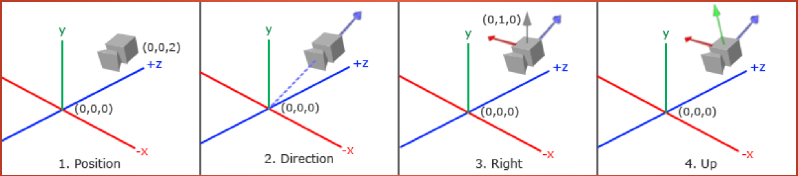

# Camera

카메라는 뷰 공간 (**View space**) 공간에서 바라본 scene을 처리한다. [[02-3d transformation pipeline]]에서 이야기헸듯이, 월드 공간에서 표현한 오브젝트들의 형상을 카메라 좌표계에서 바라볼 때 어떻게 변환되는가는 뷰 행렬 (**View Matrix**)을 통해 계산한다. 즉, 뷰 행렬은 월드 공간의 좌표를 뷰 공간의 좌표로 변환하는 행렬이다.

## 뷰 행렬

그래픽스에서 뷰 공간의 좌표계는 다음과 같이 구성된다.

1. x: right
1. y: up
1. z: backward

뷰 행렬을 계산하기 위해서는 다음 4가지가 필요하다.

1. Camera Position : 카메라 좌표계의 원점의 월드 좌표계에서의 위치
1. Direction: 카메라가 지향(look-in)하는 방향
   - z 축을 구성한다.
   - 그래픽스에서는 카메라가 오브젝트를 지향한다고 가정한다.
   - 따라서 오브젝트 원점에서 카메라 원점을 향하는 벡터이다. 방향이 우리가 직관적으로 생각하는 방향과 반대임을 기억하자.
1. Right: 카메라가 바라보는 Direction을 정면을 생각했을 때의 오른쪽 방향
   - x 축을 구성한다.
   - Direction과 월드 공간의 Up 방향 ([0, 1, 0])과 외적하면 구할 수 있다.
1. Up: 카메라가 바라보는 Direction과 Right이 정해지면 그에 따라 정해지는 위쪽 방향 (월드 공간의 Up과는 다르다. 카메라 관점에서의 위쪽 방향을 월드 공간에서 표현한 것이다.)



```c++
// position: 카메라 위치
// target: 카메라가 바라볼 위치 (카메라 위치 + 해당 위치에서 카메라를 바라보는 방향)
//         결국, direction = position - target (z축 양의 방향과 정렬되도록)
// up: 월드 좌표계의 위쪽 방향
glm::mat4 view_mat = glm::lookAt(position,target, up)
```

## 뷰 행렬 유니폼

뷰 행렬을 유니폼에 바인딩해서 쉐이더에 전달해야 카메라의 위치 변화에 따른 화면 출력 변화를 만들 수 있다.
일반적으로 다음과 같이 정점의 위치를 계산한다. 입력하는 정점 벡터 (4차원)에 model, view, projection 행렬을 곱하기 때문에 (아래의 곱셈 상으로는 반대 순서로 나타난다.) 이 행렬 곱의 결과를 MVP 행렬이라고 부른다.

```c++
gl_Position = projection * view * model * vec4(pos, 1.0);
```

## 화면 시점 이동

카메라의 위치 및 자세가 사용자 입력에 따라 변하도록 프로그래밍할 경우, 월드 좌표계에 고정되어 있는 오브젝트는 카메라 좌표계가 변함에 따라 다른 모습으로 보이게 된다. 이를 구현하기 위해서 OpenGL 확장 라이브러리에서 제공하는 함수들을 사용해야 한다.

GLFW를 사용할 경우, 키보드 입력을 얻기위해서 다음의 함수를 사용한다.

```c++
glfwGetKey(window, GLFW_KEY_W);
```

### Delta Time

키 입력에 따라 화면이 이동하도록 할 경우, 이동량을 고정하면 사용자가 어떤 환경에서 해당 프로그램을 사용하는냐에 따라 사용자가 느끼기에 단위 시간 동안의 이동량이 달라진다. 예를 들어 빠른 컴퓨터를 가지고 있어서 루프를 빠르게 돌 경우, 느린 컴퓨터 대비 많은 루프를 돌기 때문에 이동량이 늘어가게 된다. 이를 극복하기 위해 실제 사용자가 얼마나 키를 눌렀는지 시간을 측정하고 이 시간에 비례해서 이동하도록 하면, 루프가 얼마나 많이 도느냐와 상관없이 키를 눌렀을 때의 이동량은 동일해진다.

## 화면 시점 회전

카메라 좌표계를 회전시킬 때, 그래픽스에서는 오일러각을 사용한다. 하지만 항공 분야와 좌표 축에 따른 회전 방향이 다르니 주의가 필요하다. 롤, 피치, 요의 물리적 의미는 동일하지만 회전 방향이 오른손 좌표계로 생각할 때, 반대 방향이다. 즉, 그래픽스에서는 회전축과 오른손 엄지를 정렬했을 때, 손가략이 접히는 방향과 반대로 회전각을 적용한다. (근본이 없다!)

- Pitch: 위/아래 방향의 시점 변환 (x축 중심 회전, 오른손 좌표계와 반대 방향으로 회전)
- Yaw: 좌/우 방향으로 시점 변환
- Roll: Barrel roll

## Referenceß

1. [fix your timestep](https://gafferongames.com/post/fix_your_timestep/)
1.
