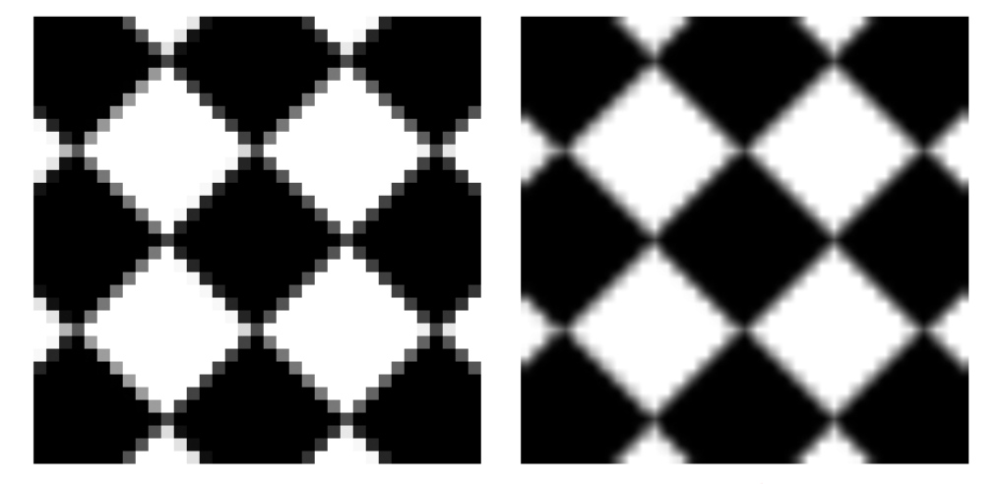
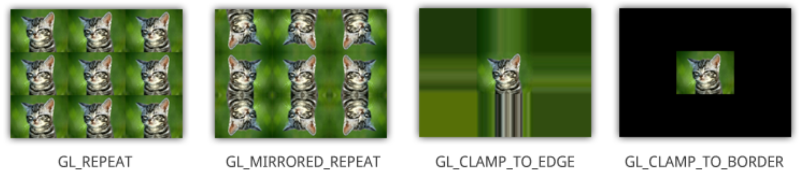
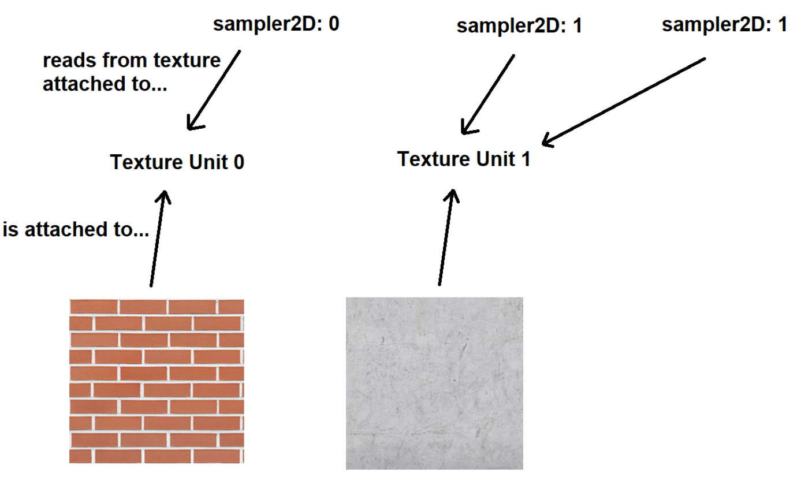

# Textures

그래픽스에서는 정점으로 구성된 오브젝트에 디테일을 부여하기 위해서 오브젝트의 면에 해당하는 지역에 이미지를 불러들여서 붙일 수 있다. 마치 아무것도 없는 정육면체의 면에 내가 원하는 사진을 스티커로 인쇄해서 붙이는 것과 동일한 개념이다.

그래픽스 분야에서는 오브젝트의 면에 붙이기 위해 불러들이는 이미지 데이터를 텍스쳐(texture)라 하며, 이를 위한 기능을 지원한다. 텍스쳐를 지원하는 그래픽스 기능을 이용하여 다른 일반적인 용도로 사용하여 고급 기능을 구현하는 경우도 있다. 따라서 텍스쳐는 일반적으로 2D이지만, 1D나 3D인 경우도 있으며 OpenGL도 이를 지원하다.

텍스쳐 위의 한 점은 픽셀(pixel)과 구분하기 위해 텍셀(texel)이라 부르며, 0과 1사이의 값들로 이루어진다.

## Texture Coordinate

텍셀을 정점과 매핑하기 위해서 텍스쳐 좌표계가 필요하다.


위의 그림에서 볼 수 있듯이 다음과 같이 매핑된다.

- bottom-left: (0, 0)
- top-left: (0, 1)
- bottom-right: (1, 0)
- top-right: (1, 1)

## Texture Object

텍스쳐 오브젝트는 VBO/VAO와 유사하게 생성하고 사용한다. `glGenTextures()` 함수를 이용해서 텍스쳐 오브젝트를 생성하고 그 ID를 반환받으면, 그 ID를 이용해서 원하는 종류의 텍스쳐를 바인딩해서 사용한다.
OpenGL이 지원하는 텍스쳐의 종류는 다음과 같다.

- GL_TEXTURE_1D
- GL_TEXTURE_2ㅇ
- GL_TEXTURE_3D
- GL_TEXTURE_CUBE_MAP

```c++
glGenTextures(1, &texture);
glBindTexture(GL_TEXTURE_2D, texture);
```

바인딩된 텍스쳐 오브젝트에 이미지 데이터를 연결하기 위해서 `glTexImage2D()` 함수를 사용한다. 각 입력 인자의 의미는 다음과 같다.

1. Texture Target (what we have bound our texture to)
1. Mipmap Level
1. Format of the stored data
1. Width of the texture
1. Height of the texture
1. Legacy argument: This should always be 0.
1. Format of the data being loaded (as opposed to stored on the third argument). 1. Data type of the values (int, float, byte, etc).
1. Pointer to the data itself

```c++
glTexImage2D(GL_TEXTURE_2D, 0, GL_RGB, width, height, 0, GL_RGB, GL_UNSIGNED_BYTE, data);
```

### Mipmaps

밉맵은 텍스쳐가 가지는 해상도 변화를 효율적으로 처리하기 위해 사용한다. 카메라와 오브젝트 사이의 거리 변화에 따라 그때 그때 오브젝트에 그려질 텍스쳐의 컬러값을 계산하는 것은 거리 변화가 크고 빈번할 경우 많은 연산을 요구한다. 따라서 텍스쳐가 가지고 있는 이미지를 해상도 변화에 대응할 수 있도록 미리 작업한 것을 보관하는 것이 밉맵이다. 높은 밉맵 레벨을 설정했다는 것은 해상도 변화에 대응해서 이미지를 여러 해상도로 미리 처리해서 보관한다는 의미다.

## Texture Parameters

텍스쳐는 정해진 해상도를 가진 이미지의 정보를 로드해서 가지고 있으며 이를 정점으로 이루어진 오브젝트에 붙일 때 어떻게 붙여야할지 결정하는 텍스쳐 변수들을 가지고 있다. 대표적으로 Filter와 Wrap 두가지 변수가 있으며, 그 의미는 다음과 같다.

- Filter: 영역 내 텍셀 값을 어떻게 정하는가?
- Wrap: 영역 밖 (0~1) 텍셀 값은 어떻게 정하는가?

### Filters

다음의 2가지 방법으로 텍셀의 컬러 값을 정한다.

- Nearest: 가장 가까운 텍셀 값을 가져온다. 텍셀 값이 불연속적이게 되어 계단 현상이 나타난다.
- Linear: 주변 텍셀들의 값의 가중평균을 구한다. 텍셀 값이 연속적이게 되지만 그로 인해 값이 변하는 부분의 기울기가 완만해진다. (값이 변하는 부분이 뭉개져 보인다.)



```c++
glTexParameteri(GL_TEXTURE_2D, GL_TEXTURE_MIN_FILTER, GL_LINEAR);
glTexParameteri(GL_TEXTURE_2D, GL_TEXTURE_MAG_FILTER, GL_LINEAR);
```

위의 코드에서 `GL_TEXTURE_MIN_FILTER`는 텍스쳐를 작게 만들 때 (카메라와 오브젝트 사이의 거리가 커질 때) 사용하는 방식을 설정할 때 사용하며, `GL_TEXTURE_MAG_FILTER`는 텍스쳐를 크게 만들 때 (카메라와 오브젝트 사이의 거리가 작아질 때) 사용하는 방식을 설정할 때 사용한다.

### Wrap

영역 밖의 텍셀 값을 결정하는 방식을 의미하며 다음의 4가지 방식을 지원한다

- `GL_REPEAT`: 텍스쳐를 반복한다.
- `GL_MIRRORED_REPEAT`: 텍스쳐를 미러링해서 반복한다.
- `GL_CLAMP_TO_EDGE`: 경계의 값으로 연장한다.
- `GL_CLAMP_TO_BORDER`: 경계를 넘어서면 클램핑한다.



```c++
glTexParameteri(GL_TEXTURE_2D, GL_TEXTURE_WRAP_S, GL_REPEAT); 
glTexParameteri(GL_TEXTURE_2D, GL_TEXTURE_WRAP_T, GL_REPEAT);
```

위의 코드에서 `GL_TEXTURE_WRAP_S`는 x축 (좌, 우)을 처리하는 방법을 , `GL_TEXTURE_WRAP_T`는 y 축 (위, 아래)을 처리하는 방법을 지정할 때, 사용한다.

## Loading Images for Textures

텍스쳐에 이미지 정보를 제공하기 위해서는 먼저 이미지를 메모리로 로딩해야한다. 하지만 이미지는 다양한 포맷을 가지고 있으며, 해당 포맷에 따라 적절하게 처리해서 데이터를 로딩해야하기 때문에 이를 직접 구현하는 것보다는 잘 구현된 Image Loader Library를 가져다가 사용하는 것이 일반적이다. 인기있는 라이브러리로는 stb_image와 Simple OpenGL Image Library(SOIL)이 있으며, 간단하게 사용할 때는 std_image를 추천한다.

stb_image를 사용하는 방법은 다음과 같다.

```c++
#define STB_IMAGE_IMPLEMENTATION
unsigned char *data =
stbi_load("image.jpg", &width, &height, &bitDepth, 0);
stbi_set_flip_vertically_on_load(true); // 필요한 경우, 이미지를 플립해야 한다.
```

## Texture Samplers

GPU에게 제공한 텍스처를 이용해서 오브젝트를 랜더링하도록 하려면 쉐이더가 해당 텍스쳐를 사용할 수 있어야 한다.
쉐이더에서는 샘플러(sampler)를 사용해서 텍스쳐에 접근한다. OpenGL에서는 텍스쳐와 샘플러가 텍스쳐 유닛에 연관되어 있기 때문에, 텍스쳐를 텍스쳐 유닛에 **attach**하면 샘플러를 통해서 텍스쳐 유닛에 붙어있는 텍스쳐 정보를 읽어온다.



텍스쳐를 텍스쳐 유닛과 어태치하는 과정은 다음과 같다.

1. 활성화할 텍스쳐 유닛 선택
1. 텍스쳐 ID를 통해 해당 텍스쳐를 활성화한 텍스쳐 유닛에 어태치
1. 샘플러를 유니폼으로 등록
1. 쉐이더에서 `sampler2D` 타입으로 텍스쳐 값을 읽어온다.
   - `texture(<sampler2D 이름>, <texture coord>)`

```c++
// Bind texture to desired Texture Unit
glActiveTexture(GL_TEXTURE0); 
glBindTexture(GL_TEXTURE_2D, textureID);
// Ensure sampler2D knows which Textuer Unit to access
glUniform1i(UniformSampler, 0);
```
