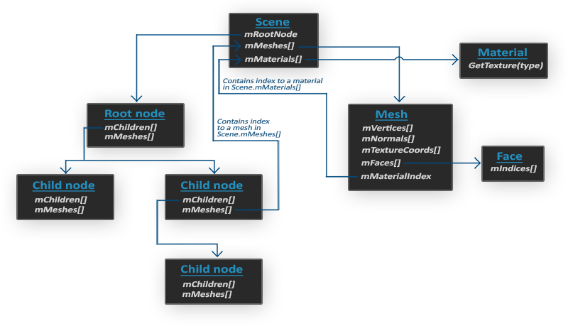

# Model

라이브러리를 이용하여 3D 모델 파일을 불러온 후, 이것을 랜더링할 수 있다.
모델 로딩에 많이 사용되는 라이브러리로는 [Assimp](https://github.com/assimp/assimp)가 있다.

## Assimp

Assimp는 모델을 입력하기 위하여 다음의 구조를 사용한다.

특징을 살펴보면 다음과 같다.

* scene은 여러 개의 메쉬와 머티리얼에 대한 포인터 배열을 가지고 있다.
* node는 scene을 tree 구조로 구성하는 단위이며, 각 노드는 scene이 가지고 있는 포인터 배열에 대한 인덱스로 해당 노드의 메쉬와 머티리얼에 대한 정보를 제공한다.
* mesh는 vertex, normal, texture coordinate, faces(indices), material index 정보를 가지고 있다.

## Model

3D 모델은 별도의 툴 (3D Max, Blender 등)을 통해 직접 만들 수도 있지만, SW 개발자는 보통 만들어진 3D 모델을 가져와서 사용한다. 무료로 3D 모델을 다운로드할 수 있는 사이트에서 원하는 모델을 다운로드하자. (실습 용으로는 Free3D 추천한다.)

Assimp에서 제공하는 mesh 클래스는 material 정보를 가지고 있지만, 메쉬를 랜더링할 때마다 텍스쳐를 로딩하고 바인딩하는 것은 비효율적이다.
따라서 해당 모델에서 제공하는 텍스쳐를 한번에 로딩하고 메쉬를 랜더링할 때마다 연관 텍스쳐를 바인딩하도록 코드를 구현하는 것을 추천한다.

## Reference

1. [Free3D](https://free3d.com/): 무료 3D 모델을 다운로드받을 수 있는 사이트
1. [(LearnOpenGL) Model Loading (en)](https://learnopengl.com/Model-Loading/Mesh)
1. [(OpenGL) Model Loading Assimp (kr)](https://ciel45.tistory.com/110)
1. [(LearnOpenGL) OpenGL Model Loading 4-3 Model (kr)](https://palamore.tistory.com/383)
